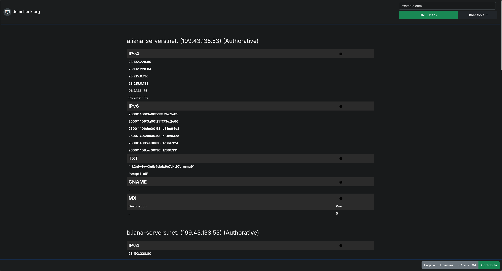
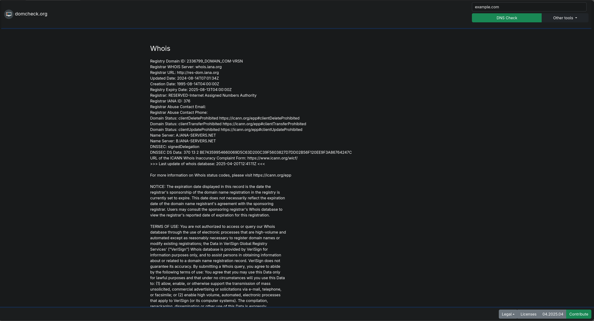
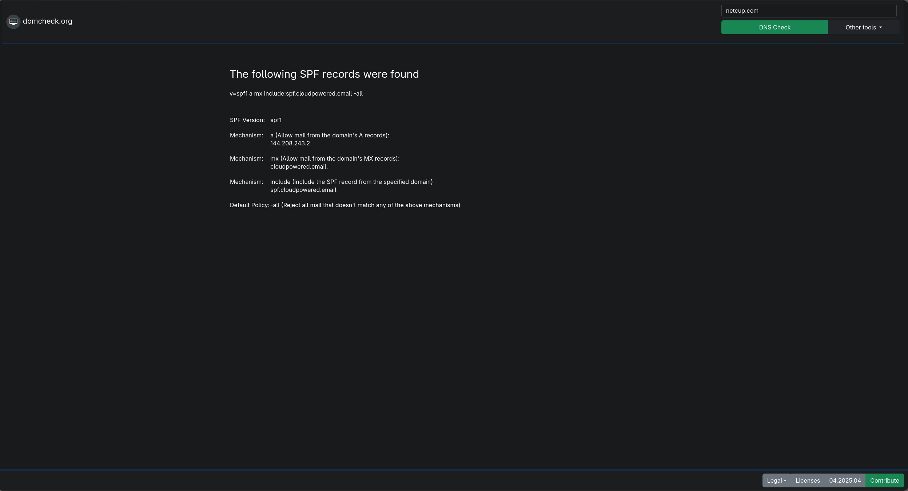
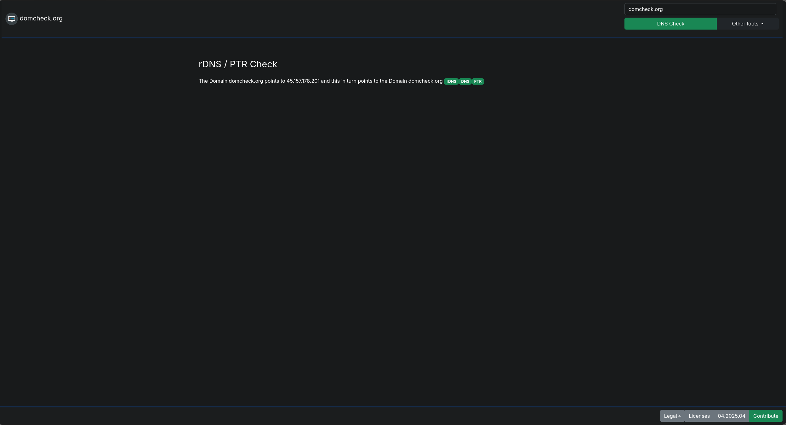

A simple domain check tool
  

# Domain Check Web UI

### Description
This tool is intended to be a simple and clear tool to obtain the necessary information to recognize problems with domains.
 
You can already use the tool at the following URL:
<a href="https://domcheck.org">domcheck.org</a>
 

### Already available features:
- DNS Lookup (Default: Authorative, Google, Cloudflare, OpenDNS)
- Warning if different nameservers deliver different DNS.
- PTR/rDNS Check
- WHOIS Lookup
- SPF Check
- IDN <-> Puny Converter  
- Configurable nameserver list

 

|                                      |                                 |
| :----------------------------------: | :-----------------------------: |
|              DNS Lookup              |             WHOIS Lookup        |
|  |     |
|              SPF Check              |          rDNS/PTR Check           |
|    |  |

### ToDo:
- DNSSEC
- WHOIS summary(WHOIS Lookup)
- Warnings when the domain has a bad status (WHOIS Lookup).
- PTR/rDNS Check for IPv6 (rDNS/PTR Check)
- Do the DNS match the provider's web hosting? (Provider Check)

 

## Requirements
- You need to edit config.php
- bind-utils
- Webserver with php
- php-yaml
- php-intl
- whois

 

# Work in Progress 🎏
## Collaboration 👥

Let's make it better together!   
Feel free to open an issue if you have any problem or suggestions 🤍

### Contributors 🧑🏾‍🤝‍🧑🏼

Made with [contrib.rocks](https://contrib.rocks).

 

### Info
Icon from [Icon-Icons.com](https://icon-icons.com/icon/window-domain-www/52810) made by [Vecteezy](https://icon-icons.com/users/49oaZ80LDyqHrUI3wINLc/icon-sets/) licensed under <a rel="license" href="http://creativecommons.org/licenses/by/4.0/">Creative Commons Attribution 4.0 International License</a>.

The page uses the Bootstrap framework.
You can use it locally. See config.php. 
Bootsrap uses the <a rel="license" href="https://raw.githubusercontent.com/twbs/bootstrap/main/LICENSE">MIT license</a>.

The page uses [Feather Icons](https://feathericons.com/)
Feather uses the <a rel="license" href="https://github.com/feathericons/feather/blob/main/LICENSE">MIT license</a>.

